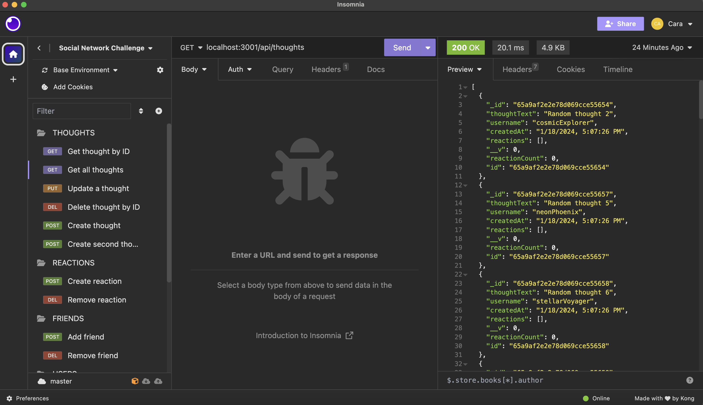
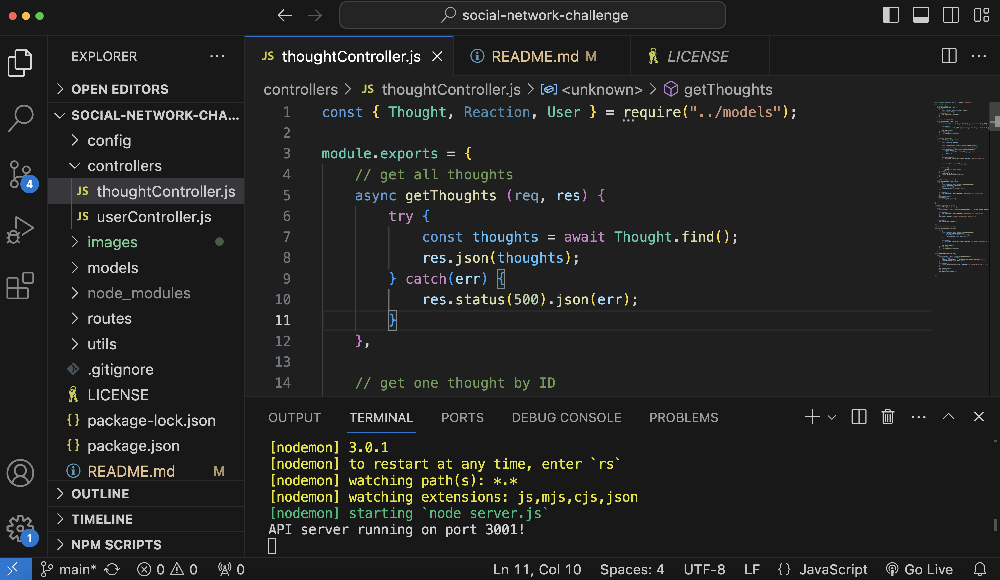
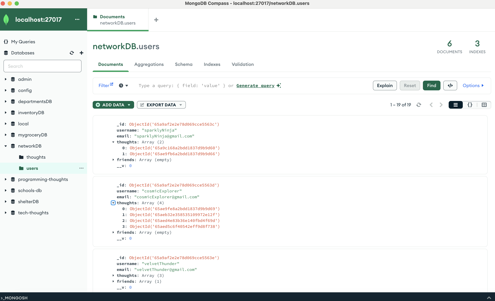
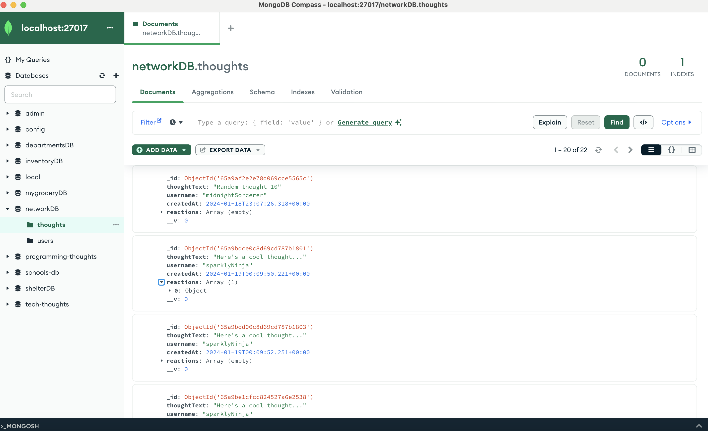

# Social Network API

## Description

The Social Network API allows users to create thoughts, react to friends' thoughts, and add and delete friends. In addition, users can add/delete reactions to other users' thoughts. This allows for a user to be able to create a friends list and even interact with their friends.

## Installation

Users can clone the GitHub repository.

A demo of the application: [Social Network API Demo Video](https://drive.google.com/file/d/1Ss7xY3dWw0Z2Z0hWJuh7quMFsPmj5nZ9/view)

Screenshots of the project are below:

## Credits

Ethan pointed out that I needed to require and export the User and Thought models in order to make them accessible to the controllers. This code can be found in index.js in in the models folder. In addition, he noted that I created a Reaction model. However, I only needed Reaction as a Schema. After hearing this explanation, I deleted the code that made Reaction a model. This code was deleted in Reaction.js in the models folder on lines 1 and 31. I also deleted the Reaction model export and replaced it by exporting the reaction schema on line 33. My teacher was able to help me with the creating a thought route. He noted that I needed to rearrange my code and change the id name. This code can be found in thoughtController.js under the comment // create a new thought. The teacher also pointed out that I needed to require the User. This code can be found in thoughtController.js on line 1.

## License

An MIT License has been applied to this project.